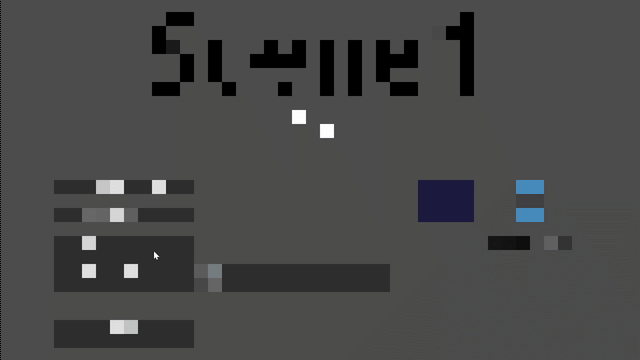

# 🎬 KaleidoWarp for Godot 4.6 and later

This is a flexible and extensible scene transition addon for Godot 4.6+ (.NET/C#) that allows for smooth, animated transitions between scenes.



[](https://www.youtube.com/watch?v=xVa2kxMozck)


## Installation 📦
You have three options:


a) Just install the addon via the Godot Asset Library from inside Godot.

_or_

b) Download the [latest release](https://github.com/kaleidocore/KaleidoWarp/releases) as a .zip or grab it from the [Godot Asset Library](https://godotengine.org/asset-library/asset?filter=kaleidowarp), extract it anywhere, then copy the `addons/kaleido_warp` folder into your project's `addons/` folder.

_or_

c) Clone the repo locally (e.g. via Github Desktop or CLI), then copy the `addons/kaleido_warp` folder into your project's `addons/` folder.

Important:
> After installation, make sure the KaleidoWarp plugin is enabled in the project settings. You might have to build the Godot project at least once before Godot can activate the plugin.

## Examples 📜

A minimal one-liner:
```csharp
using KaleidoWarp;

WarpManager.Instance.WarpToFile("res://Scenes/Scene2.tscn", ColorFade.Cover(), ColorFade.Uncover());
```

Or slightly more elaborate:
```csharp
using KaleidoWarp;

WarpManager.Instance.WarpToFile(
    "res://Scenes/Scene2.tscn",
    Pixellate.Cover(3f).Color(Colors.Blue).Amount(300f),
    Voronoi.Uncover(2f).Color(Colors.Blue).Angle(45)
);
```

Further examples can be found and previewed in the example scenes.

## WarpManager API

The primary API of the `WarpManager` class mirrors Godot's default scene navigation while adding optional transitions:
```csharp
public void WarpToFile(string scenePath, Transition? transitionOut, Transition? transitionIn)
public void WarpToPacked(PackedScene packedScene, Transition? transitionOut, Transition? transitionIn)
public void WarpToNode(Node sceneNode, Transition? transitionOut, Transition? transitionIn)
```


## Transitions

The addon comes with 5 built-in, shader based transition styles, each individually configurable:

| Transition class | Description |
|------------|-------------|
| (`Transition`) | Abstract base class for transitions |
| `ColorFade` | A basic screen fade |
| `Slide` | Slides the screen in or out towards one of the screen edges |
| `Voronoi` | A randomized bubbly pattern that sweeps across the screen at a given angle |
| `Pixellation` | A pixellating effect reminiscent of the classic Super Mario pixel fade |
| `Dissolve` | Uses a grayscale pattern texture to define when and where each screen pixel is overlaid and blended |

*You can mix and match transition styles* for outro/intro however you like - as long as both of them have the same base color and image they should overlap seamlessly.
Should this somehow not cover your needs you are free to implement your own custom transitions inherited from `Transition` (`Transition.tscn`), which handles most of the groundwork. And don't forget to share them here!


## Configuring Transitions 🎭

All transitions implement the following two static factory methods:

```csharp
// Gradually covers the screen, i.e. scene exit/outro
public static T Cover(float duration);

// Gradually uncovers the screen, i.e. scene entry/intro
public static T Uncover(float duration);
```

The factories are primarily for convencience and the main difference between `Cover()` and `Uncover()` is that the latter initializes the transition to play in reverse.

## Transition common base API

All transitions inherit from the abstract base class `Transition` and expose a fluent configuration API:
```csharp
transition
    .Duration(1f)                                 // Duration in seconds
    .Color(Colors.Black)                          // Base color of the transition overlay
    .Image("res://overlay.png", ImageFit.None)    // Optional overlay image (path or Texture2D)
    .Ease(Tween.EaseType.InOut)                   // Easing across the transition duration
    .Curve(Tween.TransitionType.Quad)             // Animation curve
    .Reverse();                                   // Reverses animation direction
```

> **Note:** `Duration()` and `Reverse()` are typically not needed directly since they are initialized by `Cover()`/`Uncover()`.

---

## ColorFade transition

This is a basic fade-in/fade-out transition.

The `ColorFade` transition does not add any additional properties beyond the base `Transition` API.

Examples:
```csharp
// Fade screen to green over 2 seconds
ColorFade.Cover(2f).Color(Colors.Green);

// Fade screen from blue over 2 seconds
ColorFade.Uncover(2f).Color(Colors.Blue);

// Fade to a texture, using black as background for transparent areas
ColorFade.Cover(3f).Image("res://my_overlay.png");

// Fade from a texture, using red as background for transparent areas
ColorFade.Uncover(3f).Color(Colors.Red).Image("res://my_overlay.png");
```

## Slide transition

This transition slides the scene in a given direction, replacing it with the color/image overlay.

The `Slide` transition adds the following properties:
```csharp
transition
    .Direction(Direction.Right)    // The direction of the slide
    .Sticky(true);                 // Whether the overlay also slides or stays fixed, i.e. "glued to the screen".
```

Examples:
```csharp
// Slide the screen out at the bottom, revealing an image on a green background
Slide.Cover(1f).Color(Colors.Green).Image("res://my_overlay.png").Direction(Direction.Bottom);

// Slide the new screen in from the top
ColorFade.Uncover(1f).Color(Colors.Green).Image("res://my_overlay.png").Direction(Direction.Top);
```

## Voronoi transition

This is a randomly generated, bubbly pattern of the color/image overlay that sweeps across the screen.

The `Voronoi` transition adds the following properties:
```csharp
transition
    .Angle(0); // The sweep angle across the screen, default 0 (left to right)
```

Examples:
```csharp
// A blue sweep from top-left to bottom-right
Voronoi.Cover(2f).Color(Colors.Blue).Angle(45);

// An image sweep, from left to right but for an entry transition.
ColorFade.Uncover(2f).Image("res://my_overlay.png", ImageFit.Stretch).Angle(180);
```

## Pixellate transition

This pixellates the scene gradually, eventually fading out to the color/image overlay.

The `Pixellation` transition adds the following properties:
```csharp
transition
    .Amount(100f)                         // The amount (ratio) of pixellation
    .Origin(new Vector2(0.5f, 0.5f));     // The effect origin in normalized screen coords, i.e. the "zoom position"
```

Examples:
```csharp
// Pixellate with a factor of 200x and fade to black
Pixellate.Cover(5f).Amount(200f);

// Reveal the new scene, less blocky and from bottom-right
Pixellate.Uncover(3f).Amount(70f).Origin(new(1,1));
```

## Dissolve transition

Dissolve transitions enable transition animations through the use of dissolve textures. A dissolve texture is just a grayscale image that the shader will sample from and use as a mask when rendering the transition color/image overlay. It starts with the dissolve color threshold set to fully black, gradually increasing it to fully white across the transition duration. At any given point in time, transition overlay pixels will only be drawn if the corresponding pixel in the dissolve texture is below the current threshold. This can effectively create infinite variations of transition animations.
The addon ships with a bunch of default dissolve textures (some stolen from [http://github.com/sempitern0](https://github.com/sempitern0/warp)) and made accessible via the `DefaultPatterns` class, but you can also provide your own Texture2D or resource path.

The `Dissolve` transition adds the following properties:
```csharp
transition
    .Pattern(p => p.Cells)      // The dissolve pattern texture to use (A DefaultPatterns lambda, a custom Texture2D, or a path to a custom texture)
    .Feather(0f)                // Sets the feathering amount for the dissolve effect, enabling smoother or sharper transitions at the dissolve edge.
    .Invert()                   // Inverts the dissolve pattern texture, effectively reversing the visual effect of the dissolve animation.
    .FlipX()                    // Flips the X coords of the dissolve texture, creating a mirrored effect along the horizontal axis of the dissolve animation.
    .FlipY();                   // Flips the Y coords of the dissolve texture, creating a mirrored effect along the vertical axis of the dissolve animation.
```

Examples:
```csharp
// Exit the scene using the default shrinking circle shape
Dissolve.Cover(2f).Pattern(p => p.Circle);

// Reveal the new scene, but start from the center and grow outwards
Dissolve.Uncover(2f).Pattern(p => p.Circle).Invert();

// Exit the scene using a custom pattern, in red
Dissolve.Cover(3f).Color(Colors.Red).Pattern("res://dissolve1.png");

// Reveal the new scene, using a different custom pattern
Dissolve.Uncover(3f).Color(Colors.Red).Pattern("res://dissolve2.png").Feather(0.2f);
```

## Cancelling transitions
The `WarpManager` class provides two methods for cancelling an ongoing transition:

```csharp
public void Abort()
```

This will abruptly reset whatever the WarpManager was doing and clear the warp queue. However, since the whole point is to provide smooth transitions, a better option is to use:
```csharp
public void Cancel(float maxDuration)
```

This will gracefully end the current transition within the alotted time by either rolling it back and/or fast-forwarding it, depending on if it is currently exiting or entering a scene. This is rare, but potentially useful if, for example, the user hits ESC during a transition and you want to return to the scene and/or bring up a menu. Another theoretical example is a custom loader scene that loads faster than expected (before even the entry transition has completed), and you quickly want to continue to the next scene.

 Example:
 ```csharp
WarpManager.Instance.Cancel(0.5f); // Cancel and clear the queue
WarpManager.Instance.WarpToFile("res://menu.tscn", ColorFade.Cover(1f), ColorFade.Uncover(1f)); // Queue a warp to the menu instead
```

## Custom loaders
For smooth loading of heavy scenes you may want to create a custom loader. However, under this framework loader scenes are nothing special; just transition (warp) to your loader scene normally, load your target scene however you want and finally transition (warp) to it when ready. The example project demonstrates this pattern.

## Issues
If you have any issues, suggestions or feature requests, just report them as usual in the [issues](https://github.com/kaleidocore/KaleidoWarp/issues).

## Show your support! ❤
I have no idea if the community actually appreciates my hard work with this addon - if you find it useful, please consider putting a star on the repo to keep me motivated!
